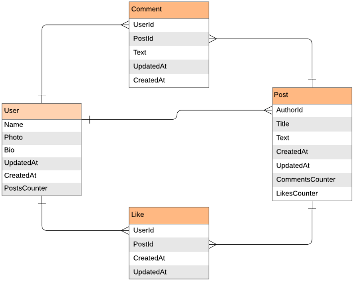

<a name="readme-top"></a>

<div align="center">
  <h1>📖 Blog App</h>
</div>

<div align="center">
  
</div>

<!-- TABLE OF CONTENTS -->

# 📗 Table of Contents

- [📖 About the Project](#about-project)
  - [🛠 Built With](#built-with)
    - [Key Features](#key-features)
  - [🚀 Live Demo](#live-demo)
- [💻 Getting Started](#getting-started)
  - [Prerequisites](#prerequisites)
  - [Setup](#setup)
- [👥 Authors](#authors)
- [🔭 Future Features](#future-features)
- [🤝 Contributing](#contributing)
- [⭐️ Show your support](#support)
- [🙏 Acknowledgements](#acknowledgements)
- [:question: FAQ](#faq)
- [📝 License](#license)

<!-- PROJECT DESCRIPTION -->

# 📖 Blog App <a name="about-project"></a>

**Blog App:** This project employs a Ruby on Rails app with PostgreSQL database, incorporating user-generated posts, comment and like counters. Ensured accurate migrations and data relationships as per ERD diagram. 📚

## 🛠 Built With <a name="built-with"></a>

  <ul>
    <li>Ruby</li>
    <li>Ruby On Rails</li>
    <li>PostgreSQL</li>
  </ul>

<!-- Features -->

### Key Features <a name="key-features"></a>

- [x] **Display Users**
- [x] **Display Posts**
- [x] **Display Comments**
- [x] **Display Likes**
- [x] **Validation & Unit Tests**
- [x] **Controllers**

<p align="right">(<a href="#readme-top">back to top</a>)</p>

<!-- LIVE DEMO -->
<!-- 
## 🚀 Live Demo <a name="live-demo"></a>

<!-- - [Live Project Demo]() -->

<!--<p align="right">(<a href="#readme-top">back to top</a>)</p> -->

<!-- GETTING STARTED -->
## Getting Started

To get a local copy up and running, follow these steps.

### Prerequisites
In order to run this project you need:
  * A basic understanding of Ruby, Rails and Git
### Usage
1. Install Ruby
1. Install Rails
2. Clone this repo 
```
git clone git@github.com:Nasirkhan294/blog_app.git
```

To run the project, execute the following command:

```
  rails s
```

To run tests, run the following command:

```
bundle exec rspec spec/models

```
<p align="right">(<a href="#readme-top">back to top</a>)</p>

<!-- AUTHORS -->

## 👥 Authors <a name="authors"></a>

👤 **Nasirkhan294**

- GitHub: [Nasirkhan294](https://github.com/Nasirkhan294)
- Twitter: [NasirMa35888225](https://twitter.com/NasirMa35888225)
- LinkedIn: [nasirmahd](https://www.linkedin.com/in/nasirmahd/)


<p align="right">(<a href="#readme-top">back to top</a>)</p>

<!-- FUTURE FEATURES -->

## 🔭 Future Features <a name="future-features"></a>

- [ ] **Add forms**

<p align="right">(<a href="#readme-top">back to top</a>)</p>

<!-- CONTRIBUTING -->

## 🤝 Contributing <a name="contributing"></a>

Contributions, issues, and feature requests are welcome!

Feel free to check the [issues page](../../issues/).

<p align="right">(<a href="#readme-top">back to top</a>)</p>

<!-- SUPPORT -->

## ⭐️ Show your support <a name="support"></a>

Please support this project and be a part of something meaningful and impactful. Your contribution can make a significant difference and help us achieve our goals faster.

<p align="right">(<a href="#readme-top">back to top</a>)</p>

<!-- ACKNOWLEDGEMENTS -->

## 🙏 Acknowledgments <a name="acknowledgements"></a>

Grateful to all for inspiring codebase, your dedication and creativity made a lasting impact on our success. Thank you!

<p align="right">(<a href="#readme-top">back to top</a>)</p>

## :question: FAQ <a name="faq"></a>

- **Can I fork and reuse this repository?**

Absolutely! Please feel free to fork and reuse this repository for your own projects.

- **Is it okay to improve this repository? Will my changes be accepted?**

Definitely! We welcome any improvements or new ideas you may have. If your changes are good and align with the project's goals, we would be happy to accept them.


<p align="right">(<a href="#readme-top">back to top</a>)</p>

<!-- LICENSE -->

## 📝 License <a name="license"></a>

This project is [MIT](./LICENSE) licensed.

<p align="right">(<a href="#readme-top">back to top</a>)</p>